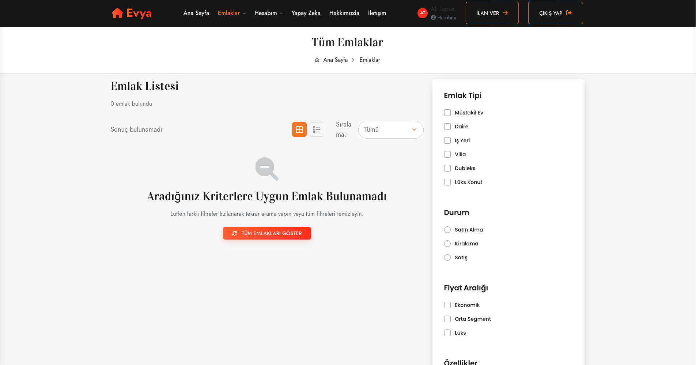
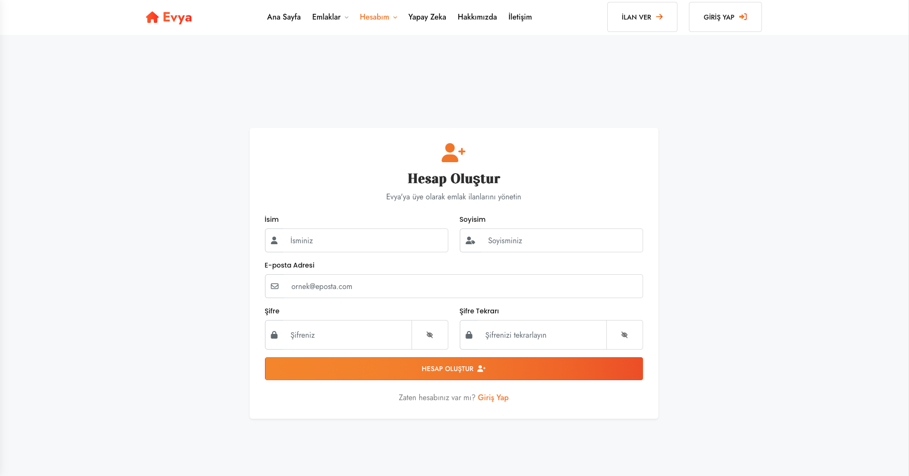
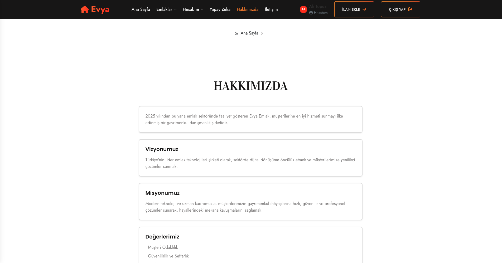

# 🏠 Evya Emlak

**Evya**, kullanıcıların uygun fiyatlı kiralık ve satılık evleri kolayca bulabileceği, modern tasarıma sahip bir emlak platformudur. Kullanıcı dostu arayüzü, gelişmiş filtreleme sistemi ve yapay zeka destekli arama özelliğiyle sektöre yeni bir soluk getirir.

🔗 **Canlı Uygulama**: [evyaemlak.com](https://evyaemlak.com)

---

## 🚀 Özellikler

- 🧠 Yapay Zeka Destekli Arama Sistemi
- 📱 Mobil Uyumlu ve Hızlı Arayüz
- 📋 Adım Adım Kolay İlan Verme
- 🔐 Güvenli Kayıt ve Giriş (Firebase)
- 💬 Hızlı İletişim ve Destek

---

## 📸 Ekran Görüntüleri

### Ana Sayfa

---

### Emlak Arama Sayfası

---

### Yapay Zeka Destekli Arama

---

### Hesap Oluşturma Sayfası

---

### Giriş Yap Sayfası

---

### Hakkımızda Sayfası

---

### İletişim Sayfası

---

### Alt Bilgi (Footer) Alanı

---

## 📌 Hedefimiz

Evya, Türkiye’de emlak arayan kullanıcılar ile ilan vermek isteyen bireyleri güvenli ve hızlı bir şekilde buluşturmayı amaçlayan modern bir platformdur.

---

## ⚠️ Bilgilendirme

Bu GitHub deposu yalnızca proje tanıtımı içindir. **Projenin kaynak kodları paylaşılmamıştır.**

---

## 📬 İletişim

- 📧 **Mail**: evyaemlak@gmail.com  
- 📍 **Konum**: Antalya / Muratpaşa

---

© 2025 **Evya Emlak** – Tüm Hakları Saklıdır.

